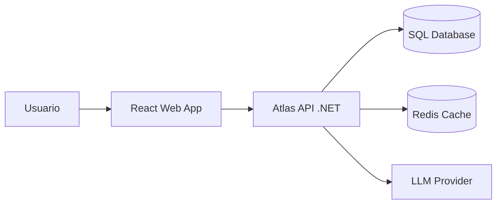

# C4 — Contexto

## Notas

- El sistema se diseña como backend modular en .NET
- Se contempla integracion futura con IA (RAG/agentes)

**Por qué C4:** porque te fuerza a pensar sistema, no endpoints sueltos.
